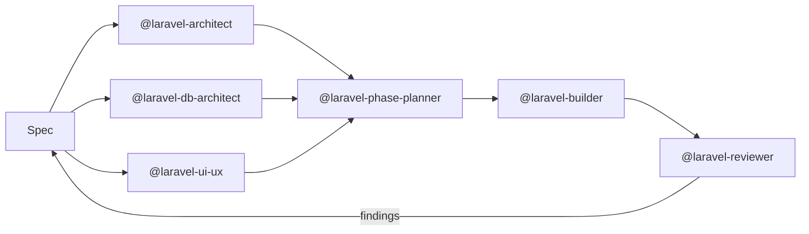

# Laravel Engineering Agents

> A multi-agent Claude Code workflow for Laravel — three specialists refine
> your spec in parallel, a planner slices it into phases, a builder ships
> them test-first, an independent reviewer audits.



| Agent | Lens | Output |
| :--- | :--- | :--- |
| `laravel-orchestrator` | Optional driver — runs the whole pipeline end-to-end so you don't dispatch each phase yourself | progress log + final summary |
| `laravel-architect` | App boundaries, events, integrations, auth | `docs/refinement/architecture.md` |
| `laravel-db-architect` | Schema, indexes, scale, big data, queries | `docs/refinement/database.md` |
| `laravel-ui-ux` | Screens, flows, states, accessibility | `docs/refinement/ui-ux.md` |
| `laravel-phase-planner` | Synthesis → small deliverable phases | `docs/phases.md` |
| `laravel-builder` | Test-first impl, KISS + SRP | code + tests |
| `laravel-reviewer` | Independent per-phase audit | review report |

## Install

**Option A — Plugin (recommended):** if your Claude Code session has the plugin marketplace enabled[^plugins], install with one command:

```
/plugin install laravel-engineering-agents@bilalelhaj/laravel-engineering-agents
```

**Option B — Manual copy:**

```bash
git clone https://github.com/bilalelhaj/laravel-engineering-agents.git
cp -r laravel-engineering-agents/.claude/agents/* .claude/agents/
```

Either way: restart Claude Code or run `/agents` — the seven agents appear in the list.

[^plugins]: [Claude Code — Plugins](https://code.claude.com/docs/en/plugins.md) — `/plugin install` reads the `.claude-plugin/plugin.json` manifest from the linked GitHub repo. The same agents work via manual `cp` if you don't use the plugin system.

## Use

**Easiest — let the orchestrator drive:**

```
@laravel-orchestrator implement docs/project-description.md
```

The orchestrator dispatches the three refinement agents in parallel, runs the planner, and loops `builder → pest → pint → reviewer` per phase. Stops on Critical / High findings and surfaces them.

**Manual control — drive each phase yourself:**

```
Read docs/project-description.md.

Run @laravel-architect, @laravel-db-architect, and @laravel-ui-ux IN PARALLEL
to refine it. Then @laravel-phase-planner to synthesize phases. Then build
phase by phase with @laravel-builder, running @laravel-reviewer after each.
```

For a one-line bug fix, skip the pipeline. Use it when the change touches the database and needs tests.

**Examples:**
- [`examples/real-run.md`](examples/real-run.md) — actual end-to-end run on a Laravel 13 / Pest 4 diary app: 3 refinement agents in parallel, phase planning with 5 conflicts auto-resolved, 3 build/review cycles, 13 new tests passing
- [`examples/walkthrough.md`](examples/walkthrough.md) — constructed minimal flow as a quick mental model

## Coding philosophy — TL;DR

| Principle | Stance |
| :--- | :--- |
| **Pragmatic Laravel, not DDD** | Eloquent *is* the repository. No bounded contexts, no aggregate roots. |
| **Actions over Services** | One Action per use case (`CreateOrder`), not `OrderService::create()`. |
| **SOLID, selectively** | SRP enforced hard. The other four only when they earn their weight. |
| **KISS + YAGNI** | If deleting the cleverest line keeps the test green, delete it. |
| **TDD** | Failing test first, then minimal impl. Always. |
| **Convention over configuration** | Laravel's idiomatic structure — no `app/Services/` etc. unless you already have them. |
| **Comments justify *why***, not *what* | A comment that restates the code is a code smell. Rename or split. |

<details>
<summary>Full breakdown of the coding philosophy</summary>

### Pragmatic Laravel, not academic DDD
The agents do not layer DDD on top of Laravel. No bounded contexts, no aggregate roots, no Repository pattern over Eloquent — Eloquent **is** the repository[^ddd-laravel]. We trust the framework's defaults. If you need Hexagonal Architecture, this isn't the right tool.

### Actions over Services
Write paths live in single-purpose **Action classes** (`app/Actions/{Domain}/{Verb}{Noun}.php`)[^actions]. One Action = one use case. A "service" with 20 methods is rejected on sight; it gets split per use case.

### SOLID — selectively, not religiously

| Principle | Enforced? | Why |
| :--- | :--- | :--- |
| **S** Single Responsibility | **Yes, hard rule** | Action does one thing; model owns persistence; controller routes |
| **O** Open/Closed | When extension is real | Premature `Strategy` patterns rejected |
| **L** Liskov Substitution | Where inheritance is used (rare) | Most code is composition |
| **I** Interface Segregation | When there's a second impl or test seam | One impl = no interface |
| **D** Dependency Inversion | Where boundaries cross (mailers, payment) | Don't inject `OrderRepository` if Eloquent works |

### KISS and YAGNI are non-negotiable
> *"If I delete the most clever line of this diff, does the test still pass?"* If yes, delete it.

This is in the `laravel-builder` system prompt verbatim. Premature flags, unused interfaces, configurability for hypothetical future needs — all rejected.

### Test-Driven Development
The builder writes a failing Pest test first, confirms red, writes the minimal code to make it green, then refactors[^tdd]. Not religion — LLMs without a passing test as a target hallucinate happy-path-only code.

### Convention over Configuration
The agents follow Laravel's idiomatic structure rather than introducing custom layers. They will not create `app/Services/`, `app/Repositories/`, or `app/DTOs/` unless your project already has them[^conventions].

### What this means in practice
- `app/Models/` stays small. Models own relations, casts, scopes, accessors. Nothing else.
- `app/Http/Controllers/` methods stay under 10 lines. Form Request → Action → Resource.
- `app/Actions/` grows feature by feature. One file per use case.
- Tests live next to the routes that exist. Feature tests cover happy + at least one failure path. Arch tests guard the rules you care about[^arch-tests].

If you want a different style — God services, fat models, Repository wrappers — these agents will fight you on it. Fork and adapt the system prompts.

</details>

## Stack support

The agents detect your stack from `composer.json` and adapt — they're not pinned to one version.

| Component | Supported |
| :--- | :--- |
| Laravel | 10, 11, 12, 13[^laravel] |
| PHP | 8.2+ recommended (8.3+ ideal) |
| Pest | 3, 4[^pest] |
| Filament | 3, 4[^filament] |
| Tailwind | 3, 4 |

## Models

Subagents declare no `model:` field — they **inherit your Claude Code session model**[^model]. Run Opus → all agents Opus. Run Sonnet → all Sonnet.

For complex features, **Opus is recommended for the refinement phase**. Sonnet is fine for the build/review loop.

## Design choices

<details>
<summary><strong>Why subagents and not skills?</strong></summary>

Both are markdown files with frontmatter — but they behave fundamentally differently[^subagents-skills].

**Three things skills would break:**

1. **Reviewer loses independence.** A skill-based reviewer would inherit the builder's full transcript and have anchoring bias — it has *already seen* the implementation by the time review starts. A subagent reviewer sees only the diff. That's where independent findings come from.

2. **Refinement can't run in parallel.** Subagents support real parallel execution[^parallel-cite]. Skills run inline in the main conversation, serialized. Sequential refinement means each downstream lens biases toward the upstream one — losing the cross-check.

3. **Main context collapses.** Architect deliberation, builder retries, reviewer scans — as subagents, all of that lives in *their* contexts. As skills, it lands in yours. By phase 3 you'd be out of room.

**When skills are the right call:** procedural rules the agent always applies (e.g. *"always run `pint --dirty` after edits"*). Those live inside agent system prompts. Subagents are for autonomous units of work that produce a deliverable.

</details>

<details>
<summary><strong>Why three lenses in refinement, not one big architect?</strong></summary>

Three reasons:

1. **Cross-check value.** When db-architect plans an index strategy, ui-ux is independently planning the screen that uses it. The phase-planner's first job is to verify the three lenses agree. A single agent has no peer to disagree with.

2. **Parallel speed.** All three run simultaneously. Refinement that would take 15 minutes sequentially takes 5 in parallel.

3. **Specialization.** A single architect is a generalist that does everything okay. db-architect knows partial indexes, partitioning thresholds, generated columns. ui-ux knows empty/loading/error state coverage. Neither is a footnote in a generalist prompt — they're the whole prompt.

</details>

<details>
<summary><strong>Why an independent reviewer instead of having the builder review itself?</strong></summary>

Builders that review themselves rubber-stamp. They have sunk-cost feelings about the code they just wrote. The reviewer is a separate context that has only seen the diff — no attachment, no anchoring. The categories it flags (N+1, fat controller, Filament version mismatch) are exactly what a self-review misses.

</details>

## What these agents will *not* do

- Invent business logic without a spec — the architect asks clarifying questions until it's unambiguous
- Skip tests
- Modify `.env`, `composer.lock`, or run `composer update` without explicit instruction
- Commit on your behalf

## Roadmap

- [x] Six-agent refinement+build pipeline
- [x] `laravel-orchestrator` — drives the whole pipeline end-to-end
- [x] Plugin packaging (`.claude-plugin/plugin.json`)
- [x] Real-run lessons baked back: defense-in-depth conflicts now caught at the planner layer (not after the fact by the reviewer)
- [ ] `laravel-debugger` — failing-tests / production-error specialist
- [ ] `laravel-migrator` — version upgrade specialist (L10→11→12→13)
- [ ] `filament-builder` — specialized Filament 4 resources / forms / tables
- [ ] Submission to the [Anthropic plugin marketplace](https://claude.ai/settings/plugins/submit)

Issues and PRs welcome.

## License

[MIT](LICENSE) © Bilal El Haj

---

[^ddd-laravel]: [Laravel docs — Eloquent](https://laravel.com/docs/12.x/eloquent) — Eloquent is an "ActiveRecord" implementation. Wrapping it in a Repository pattern adds indirection without removing the framework dependency.
[^actions]: [Spatie — Laravel Beyond CRUD: Actions](https://stitcher.io/blog/laravel-beyond-crud-03-actions) — popularized the Action class pattern in the Laravel community.
[^tdd]: [Pest docs — Writing Tests](https://pestphp.com/docs/writing-tests).
[^conventions]: [Laravel docs — Directory Structure](https://laravel.com/docs/12.x/structure).
[^arch-tests]: [Pest 3 — Arch testing](https://pestphp.com/docs/arch-testing).
[^laravel]: [Laravel — Release notes](https://laravel.com/docs/12.x/releases).
[^pest]: [Pest docs](https://pestphp.com/docs/writing-tests). Pest 4 adds Browser testing.
[^filament]: [Filament 4 upgrade guide](https://filamentphp.com/docs/4.x/upgrade-guide).
[^model]: [Claude Code — Subagents § Configuration](https://code.claude.com/docs/en/agents.md) — when `model` is omitted, the subagent inherits the parent session's model.
[^subagents-skills]: [Claude Code — Subagents](https://code.claude.com/docs/en/agents.md) and [Skills](https://code.claude.com/docs/en/skills.md).
[^parallel-cite]: [Claude Code — Subagents § Coordination](https://code.claude.com/docs/en/agents.md) — main conversation can dispatch multiple subagents in parallel via multiple `Task` calls in one turn.
