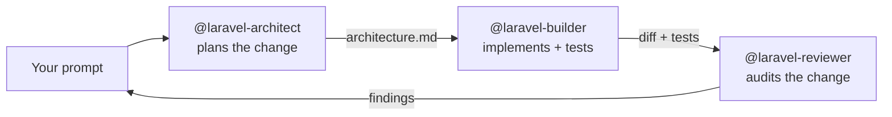

# Laravel Engineering Agents

> A multi-agent Claude Code workflow for Laravel: architect, build, and review
> features end-to-end with three specialized subagents.



Three subagents, each with isolated context, each specialized:

| Agent | Role | Model |
| :--- | :--- | :--- |
| `laravel-architect` | Designs the change. Asks clarifying questions. Outputs migration plan, model relationships, controller/action layout, test strategy. | sonnet |
| `laravel-builder` | Implements the plan: migrations, models, actions, Pest tests. Test-first. Runs the suite, retries on failure. | sonnet |
| `laravel-reviewer` | Read-only audit pass: N+1 queries, fat controllers, missing tests, Filament 4 anti-patterns, security holes. | haiku |

## Why three agents and not one big prompt

Claude Code subagents run in isolated context windows[^1]. That matters for Laravel work because:

1. **Architecture stays out of the implementation context.** The builder doesn't see the architect's deliberation — only the final plan. Less noise, fewer hallucinations.
2. **Review is independent.** A reviewer that read the implementation transcript will rubber-stamp it. A reviewer that sees only the diff finds real problems.
3. **You can re-run a single phase.** "Re-architect with these constraints" or "re-review" without rebuilding everything.

## Why subagents and not skills

Claude Code offers two related primitives — **subagents** and **skills** — and the choice matters here.

| | Subagent | Skill |
| :--- | :--- | :--- |
| Context | Fresh, isolated[^1] | Inline in current conversation[^2] |
| Best for | Self-contained tasks that produce verbose output you won't reference later | Reusable instructions, conventions, playbooks referenced during work |
| Tool restrictions | Whitelist via `tools:` field[^1] | `allowed-tools:` field[^2] |

For an architect → builder → reviewer pipeline, **subagents are the right fit**: each phase is self-contained, the reviewer needs to *not* see the builder's transcript, and the architect's clarifying-question dialogue should not pollute the implementation context. Skills would inline all three into one conversation and defeat the purpose.

[^1]: [Claude Code — Subagents](https://code.claude.com/docs/en/agents.md): "Subagents are AI assistants that your primary Claude Code agent can delegate tasks to. Each subagent has its own context, custom system prompt, and configured set of tools."
[^2]: [Claude Code — Skills](https://code.claude.com/docs/en/skills.md): skills load inline into the current conversation as reusable task instructions.

## Installation

These agents are designed for [Claude Code](https://claude.ai/code).

```bash
git clone https://github.com/bilalelhaj/laravel-engineering-agents.git
cp -r laravel-engineering-agents/.claude/agents/* ~/.claude/agents/
```

Or, scoped to a single project:

```bash
mkdir -p .claude/agents
cp -r path/to/laravel-engineering-agents/.claude/agents/* .claude/agents/
```

Restart Claude Code (or run `/agents`) — the three agents appear in the list.

## Usage

The simplest entry point is to ask the main conversation to run the pipeline:

```
Use @laravel-architect to plan a "user can subscribe to a newsletter" feature,
then @laravel-builder to implement it, then @laravel-reviewer to audit.
```

Or invoke each phase individually:

```
@laravel-architect plan migrations and tests for soft-deleting orders
@laravel-builder implement docs/architecture.md
@laravel-reviewer audit the last commit
```

See [examples/walkthrough.md](examples/walkthrough.md) for a full end-to-end run on a sample feature.

## What these agents assume

- **Laravel 12+** with **PHP 8.3+**[^3]
- **Pest 3** for tests[^4] (the agents will reject PHPUnit-style tests in mixed codebases unless you tell them otherwise)
- **Filament 4** for admin panels[^5] (v3 syntax is flagged as a code smell)
- **Laravel Boost** is *recommended but not required* — when present, agents will use `boost:install` to register their guidelines

[^3]: [Laravel 12 release notes](https://laravel.com/docs/12.x/releases) — Laravel 12 requires PHP 8.2+; we recommend 8.3+ for the strict typing the agents emit.
[^4]: [Pest 3 docs](https://pestphp.com/docs/writing-tests) — `describe()`, datasets, higher-order tests, and Arch testing.
[^5]: [Filament 4 upgrade guide](https://filamentphp.com/docs/4.x/upgrade-guide) — Schema-based forms (`Schema $schema`), consolidated `Filament\Actions\*` namespace, `Livewire\Livewire::test()` for resource testing.

## What these agents will *not* do

- They will not invent business logic without a spec — `@laravel-architect` asks clarifying questions until the requirement is unambiguous
- They will not skip tests
- They will not modify `.env`, `composer.lock`, or run `composer update` without explicit instruction
- They will not commit on your behalf

## Comparison to single-prompt workflows

| | Single big prompt | Three subagents |
| :--- | :--- | :--- |
| Context contamination | High — planning + impl + review compete for the same tokens | Low — each agent has its own window |
| Re-run cost | Whole conversation | One phase |
| Reviewer independence | Compromised | Genuine — sees only the diff |
| Token cost per feature | ~30-50% lower (one context) | Higher (three contexts) |
| Repeatability across team members | Brittle — depends on prompt phrasing | High — agents encode the conventions |

This is **not** a magic bullet. For a one-line bug fix you don't need the orchestra. Use it for features that touch the database and need tests.

## Roadmap

- [x] `laravel-architect`, `laravel-builder`, `laravel-reviewer`
- [ ] `filament-builder` — specialized for Filament 4 resources, forms, tables
- [ ] `laravel-debugger` — focused on failing tests / production errors
- [ ] Plugin packaging (`.claude-plugin/plugin.json`) for one-line install
- [ ] Submission to the Anthropic plugin marketplace

Issues and PRs welcome.

## License

[MIT](LICENSE) © Bilal El Haj
