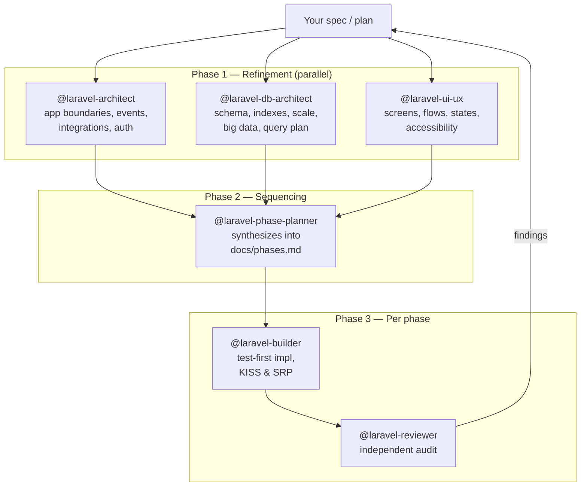

# Laravel Engineering Agents

> A multi-agent Claude Code workflow for Laravel. You give it a feature spec
> or an entire app plan; three specialists refine it in parallel, a planner
> slices it into deliverable phases, a builder ships them test-first, and an
> independent reviewer audits each phase.



Five subagents, each with isolated context, each specialized:

| Agent | Role | Output |
| :--- | :--- | :--- |
| `laravel-architect` | Application-logic lens — boundaries, events, integrations, authorization, idempotency. Asks clarifying questions. | `docs/refinement/architecture.md` |
| `laravel-db-architect` | Data-layer lens — schema, indexes, FKs, soft deletes, JSON, partitioning, big-data growth, query patterns. | `docs/refinement/database.md` |
| `laravel-ui-ux` | UI lens — screens, user flows, empty/loading/error states, Filament/Livewire/Blade conventions, accessibility. | `docs/refinement/ui-ux.md` |
| `laravel-phase-planner` | Synthesizes the three refinement docs into small, deliverable phases with tests as acceptance criteria. | `docs/phases.md` |
| `laravel-builder` | Implements one phase at a time, test-first. Hard rules: KISS, SRP, no premature abstractions. | code + tests |
| `laravel-reviewer` | Read-only audit per phase — N+1, fat controllers, version-correct Filament syntax, KISS/SRP violations, security. | review report |

### Models

The agents declare no `model` field — they **inherit your Claude Code session model**[^model]. If you run a session on Opus, every agent runs on Opus. If you run Sonnet, all run on Sonnet. The only exception worth making is to pin Opus for the architect/db-architect when you specifically want maximum reasoning during refinement.

For complex features, **Opus is recommended for the refinement phase** (architect + db-architect + ui-ux) — it catches more edge cases and asks better questions. Sonnet is fine for the build/review loop on most features.

[^model]: [Claude Code — Subagents § Configuration](https://code.claude.com/docs/en/agents.md) — when `model` is omitted, the subagent inherits the parent session's model.

## Why three agents and not one big prompt

Claude Code subagents run in isolated context windows[^1]. That matters for Laravel work because:

1. **Architecture stays out of the implementation context.** The builder doesn't see the architect's deliberation — only the final plan. Less noise, fewer hallucinations.
2. **Review is independent.** A reviewer that read the implementation transcript will rubber-stamp it. A reviewer that sees only the diff finds real problems.
3. **You can re-run a single phase.** "Re-architect with these constraints" or "re-review" without rebuilding everything.

## Coding philosophy

The agents are opinionated. Here's where they stand on the famous architectural debates so you can decide if it matches yours.

### Pragmatic Laravel, not academic DDD

The agents do **not** layer Domain-Driven Design on top of Laravel. No bounded contexts as first-class artifacts, no aggregate roots, no Repository pattern over Eloquent. Eloquent **is** the repository[^ddd-laravel]. We trust the framework's defaults. If you need Hexagonal Architecture, this isn't the right tool.

### Actions over Services

Write paths live in single-purpose **Action classes** (`app/Actions/{Domain}/{Verb}{Noun}.php`)[^actions]. One Action = one use case. `CreateOrder`, not `OrderService::create()`. A "service" with 20 methods is rejected on sight; it gets split per use case.

### SOLID — selectively, not religiously

Of the five SOLID principles, the agents enforce two and treat the rest as situational:

| Principle | Enforced? | Why |
| :--- | :--- | :--- |
| **S** — Single Responsibility | **Yes, hard rule** | An Action does one thing; a model owns persistence; a controller routes |
| **O** — Open/Closed | Only when an extension point is real | Premature `Strategy` patterns get rejected |
| **L** — Liskov Substitution | Where inheritance is used (rare in Laravel) | Most code is composition |
| **I** — Interface Segregation | Only when there's a second implementation or a real test seam | One implementation = no interface |
| **D** — Dependency Inversion | Where boundaries genuinely cross (mailers, payment gateways) | Don't inject `OrderRepository` if Eloquent works |

### KISS and YAGNI are non-negotiable

> *"If I delete the most clever line of this diff, does the test still pass?"*
> If yes, delete it.

This is in the `laravel-builder` system prompt verbatim. Premature flags, unused interfaces, configurability for hypothetical future needs — all rejected.

### Test-Driven Development

The builder writes a failing Pest test **first**, confirms red, then writes the minimal code to make it green, then refactors[^tdd]. Not because TDD is a religion, but because LLMs without a passing test as a target hallucinate happy-path-only code.

### Convention over Configuration

The agents follow Laravel's idiomatic structure rather than introducing custom layers. They will **not** create `app/Services/`, `app/Repositories/`, or `app/DTOs/` unless your project already has them[^conventions].

### Comments justify *why*, not *what*

A comment that restates the code is a code smell — rename or split. Comments are reserved for business rules, performance trade-offs, RFC links, and surprising edge cases.

### What this means in practice

- Your `app/Models/` stays small. Models own relations, casts, scopes, accessors. Nothing else.
- Your `app/Http/Controllers/` methods stay under 10 lines. They resolve a Form Request, call an Action, return a Resource.
- Your `app/Actions/` directory grows feature by feature. One file per use case.
- Your tests live next to the routes that exist. Feature tests cover happy and at least one failure path. Arch tests guard the rules you care about[^arch-tests].

If you want a different style — God services, fat models, Repository wrappers, custom layered architecture — these agents will fight you on it. Fork and adapt the system prompts to your house style.

[^ddd-laravel]: [Laravel docs — Eloquent](https://laravel.com/docs/12.x/eloquent) — Eloquent is an "ActiveRecord" implementation. Wrapping it in a Repository pattern adds indirection without removing the framework dependency.
[^actions]: [Spatie — Laravel Beyond CRUD: Actions](https://stitcher.io/blog/laravel-beyond-crud-03-actions) — popularized the Action class pattern in the Laravel community.
[^tdd]: [Pest docs — Writing Tests](https://pestphp.com/docs/writing-tests) — Pest's test-first design pairs naturally with the red/green/refactor loop.
[^conventions]: [Laravel docs — Directory Structure](https://laravel.com/docs/12.x/structure) — the framework's recommended layout. Custom folders are tolerated but not idiomatic.
[^arch-tests]: [Pest 3 — Arch testing](https://pestphp.com/docs/arch-testing) — encode "controllers don't import `DB` facade" or "models extend Model" as failing tests.

## Why subagents and not skills

Claude Code offers two ways to package reusable AI workflows — **subagents** and **skills**[^subagents-skills]. They look similar (both are markdown files with frontmatter), but they behave fundamentally differently. We chose subagents deliberately, and skills would have broken three things this pipeline depends on.

### The technical difference

| | Subagent | Skill |
| :--- | :--- | :--- |
| Where it runs | A **separate Claude instance** with its own context window[^subagents] | **Inline** in your main conversation, as additional instructions[^skills] |
| What it returns | A single result message back to the orchestrator | Continued output in your main conversation |
| Parallelism | Multiple subagents can run **truly parallel** | Sequential — runs in your main context |
| Token cost | Higher (each agent has its own context) | Lower (shares one context) |
| When the orchestrator sees the output | Just the final summary | Everything — prompt, reasoning, tool calls, output |

### What would break if we used skills

**1. The reviewer would lose its independence.**

If `laravel-reviewer` were a skill, it would run in the same context that already contains the builder's full transcript — every file the builder wrote, every test it ran, every retry. A reviewer in that state has anchoring bias: it has *already seen* and *implicitly endorsed* the implementation by the time it starts reviewing. It will not flag what it just watched go in.

A subagent reviewer sees **only the diff** (or whatever the orchestrator hands it). It has no sunk-cost feelings about the code. That's where independent findings come from.

**2. The refinement phase couldn't run in parallel.**

The architect, db-architect, and ui-ux agents are designed to work **simultaneously** on the same spec — three lenses on one problem. Subagents support this directly[^parallel-cite]; skills don't, because skills run inline and serialize into your main conversation.

A skill-based "refinement" would have to be sequential: architect first, then db, then ui. Each downstream skill would read the upstream output and bias toward it. We'd lose the cross-check value of three independent perspectives.

**3. Your main context would collapse.**

When `laravel-architect` runs, it asks 5–15 clarifying questions, reads dozens of files, deliberates over edge cases. As a subagent, all of that happens in *its* context window — your main conversation only sees the final `architecture.md` file path.

As a skill, every question, every file read, every deliberation lands in your main context. By the time the architect finishes, your context is half-full. By the time the builder finishes, you're out of room. The reviewer either gets a stub of context or fails.

### When skills would be the right choice

We use skills *inside* the agents — that's the right layer. Examples of things that would be skills (or rules), not subagents:

- *"Before writing a migration, check existing tables for conflicting unique indexes"* — a procedural rule the architect always follows. Lives in the architect's system prompt or a referenced skill.
- *"For every API response, the test must include a JSON schema assertion"* — a checklist item. Same.
- *"Always run `pint --dirty` after edits"* — convention. Same.

These are **non-autonomous** — they don't reason on their own, they're patterns the agent applies. Subagents are for **autonomous units of work that produce a deliverable**.

### Summary

A pipeline that needs (a) independent review, (b) parallel work, and (c) bounded context per phase is exactly what subagents exist for. We cited the docs in [^subagents-skills] so you can verify; if your use case doesn't need any of (a)/(b)/(c), skills are simpler and cheaper — use those instead.

[^subagents-skills]: Both primitives are documented at [code.claude.com/docs/en/agents.md](https://code.claude.com/docs/en/agents.md) and [code.claude.com/docs/en/skills.md](https://code.claude.com/docs/en/skills.md). The "Subagent vs Skill" comparison comes directly from those pages.
[^subagents]: [Claude Code — Subagents](https://code.claude.com/docs/en/agents.md): *"Each subagent has its own context, custom system prompt, and configured set of tools."*
[^skills]: [Claude Code — Skills](https://code.claude.com/docs/en/skills.md): skills load inline into the current conversation as reusable task instructions, sharing the parent context window.
[^parallel-cite]: [Claude Code — Subagents § Coordination](https://code.claude.com/docs/en/agents.md): the main conversation can dispatch multiple subagents in parallel by issuing multiple `Task` tool calls in one turn.

## Installation

These agents are designed for [Claude Code](https://claude.ai/code).

```bash
git clone https://github.com/bilalelhaj/laravel-engineering-agents.git
cp -r laravel-engineering-agents/.claude/agents/* ~/.claude/agents/
```

Or, scoped to a single project:

```bash
mkdir -p .claude/agents
cp -r path/to/laravel-engineering-agents/.claude/agents/* .claude/agents/
```

Restart Claude Code (or run `/agents`) — the three agents appear in the list.

## Usage

The full pipeline for a non-trivial feature, run from the main conversation:

```
Read docs/project-description.md.

Run @laravel-architect, @laravel-db-architect, and @laravel-ui-ux IN PARALLEL
to refine it. When all three are done, run @laravel-phase-planner to
synthesize the phases. Then build phase by phase with @laravel-builder,
running @laravel-reviewer after each phase.
```

Claude Code is capable of dispatching multiple subagents in parallel when you ask explicitly[^parallel].

Or invoke each phase individually:

```
@laravel-architect refine the spec in docs/project-description.md
@laravel-db-architect refine the spec in docs/project-description.md
@laravel-ui-ux refine the spec in docs/project-description.md

# Once all three docs/refinement/*.md exist:
@laravel-phase-planner

# Per phase:
@laravel-builder implement Phase 1
@laravel-reviewer audit Phase 1
```

For small changes (one-line fix, typo, isolated bug), skip the pipeline and prompt the main conversation directly. The pipeline pays off when the change touches the database and needs tests.

See [examples/walkthrough.md](examples/walkthrough.md) for a full end-to-end run on a sample feature.

[^parallel]: [Claude Code — Subagents § Coordination](https://code.claude.com/docs/en/agents.md) — subagents can be dispatched in parallel by the main conversation when explicitly requested.

## What these agents assume

The agents detect your stack from `composer.json` and adapt — they're not pinned to one version.

| Component | Supported | Notes |
| :--- | :--- | :--- |
| **Laravel** | 10, 11, 12, 13[^laravel] | Agents adapt to `bootstrap/app.php` (L11+) vs legacy kernels |
| **PHP** | 8.2+ recommended (8.3+ ideal) | The strict typing the agents emit needs 8.2+ |
| **Pest** | 3, 4[^pest] | Pest 4's new arch syntax and Browser tests are detected |
| **Filament** | 3, 4[^filament] | Different form/action namespaces — agents follow what's installed |
| **Tailwind** | 3, 4 | UI agent detects v4's config-less mode |
| **Laravel Boost** | Optional | When present, agents register their guidelines via `boost:install` |

[^laravel]: [Laravel — Release notes](https://laravel.com/docs/12.x/releases) — agents read `composer.json` to determine the project's major version.
[^pest]: [Pest docs](https://pestphp.com/docs/writing-tests) — `describe()`, datasets, higher-order tests, Arch testing. Pest 4 adds Browser testing.
[^filament]: [Filament 4 upgrade guide](https://filamentphp.com/docs/4.x/upgrade-guide) — Schema-based forms (`Schema $schema`), consolidated `Filament\Actions\*` namespace, `Livewire\Livewire::test()` for resource testing.

## What these agents will *not* do

- They will not invent business logic without a spec — `@laravel-architect` asks clarifying questions until the requirement is unambiguous
- They will not skip tests
- They will not modify `.env`, `composer.lock`, or run `composer update` without explicit instruction
- They will not commit on your behalf

## Comparison to single-prompt workflows

| | Single big prompt | Three subagents |
| :--- | :--- | :--- |
| Context contamination | High — planning + impl + review compete for the same tokens | Low — each agent has its own window |
| Re-run cost | Whole conversation | One phase |
| Reviewer independence | Compromised | Genuine — sees only the diff |
| Token cost per feature | ~30-50% lower (one context) | Higher (three contexts) |
| Repeatability across team members | Brittle — depends on prompt phrasing | High — agents encode the conventions |

This is **not** a magic bullet. For a one-line bug fix you don't need the orchestra. Use it for features that touch the database and need tests.

## Roadmap

- [x] `laravel-architect` — application-logic refinement
- [x] `laravel-db-architect` — data-layer refinement
- [x] `laravel-ui-ux` — UI/UX refinement
- [x] `laravel-phase-planner` — synthesizes refinement docs into phases
- [x] `laravel-builder` — phase-by-phase implementation
- [x] `laravel-reviewer` — independent per-phase audit
- [ ] `laravel-debugger` — specialized for failing tests / production errors
- [ ] `laravel-migrator` — version upgrade specialist (L10→11→12→13)
- [ ] Plugin packaging (`.claude-plugin/plugin.json`) for one-line install
- [ ] Submission to the Anthropic plugin marketplace

Issues and PRs welcome.

## License

[MIT](LICENSE) © Bilal El Haj
