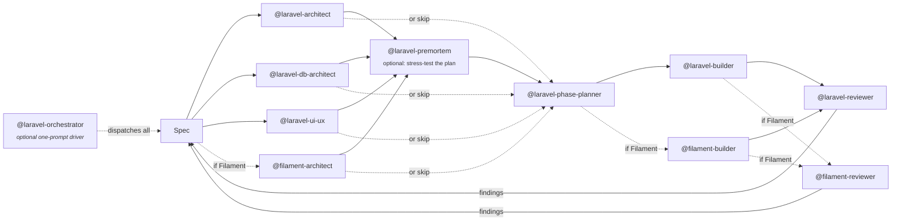
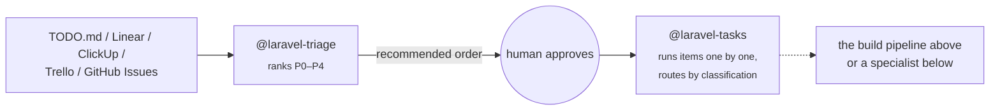

# Agent reference

All 18 agents, the pipeline they form, and the stack they detect.

## The standard build pipeline

`@laravel-orchestrator` runs this end-to-end with one prompt:

## The backlog flow

External task sources (Linear / ClickUp / Trello / GitHub Issues) are wired in [`INTEGRATIONS.md`](INTEGRATIONS.md).

## Generic Laravel agents — load on every project

| Agent | Lens | Output |
| :--- | :--- | :--- |
| `laravel-orchestrator` | Optional driver — runs the whole pipeline end-to-end so you don't dispatch each phase yourself | progress log + final summary |
| `laravel-architect` | App boundaries, events, integrations, auth | `docs/refinement/architecture.md` |
| `laravel-db-architect` | Schema, indexes, scale, big data, queries | `docs/refinement/database.md` |
| `laravel-ui-ux` | Screens, flows, states, accessibility | `docs/refinement/ui-ux.md` |
| `laravel-phase-planner` | Synthesis → small deliverable phases | `docs/phases.md` |
| `laravel-builder` | Test-first impl, KISS + SRP | code + tests |
| `laravel-reviewer` | Independent per-phase audit | review report |

## Filament family — load only if your project uses Filament

| Agent | Lens | Output |
| :--- | :--- | :--- |
| `filament-architect` | Panel layout, resource organization, tenancy, plugins, custom pages, widgets | `docs/refinement/filament.md` |
| `filament-builder` | Builds Resources / Pages / Widgets / Clusters with `make:filament-*` generators, Schema-based forms, `Livewire::test()` patterns | code + tests |
| `filament-reviewer` | Independent Filament-specific audit — Schema N+1, plugin compat, tenancy leaks, v3↔v4↔v5 stale syntax | review report |

## On-demand agents — invoke when you need them

| Agent | When | Output |
| :--- | :--- | :--- |
| `laravel-debugger` | A test goes red unexpectedly, a stack trace points at vendor code, "works in dev but not in CI". Forms 3–5 hypotheses, narrows with cheap commands, hands you a minimal patch description. **Read-only** — does not implement the fix. | debug report |
| `laravel-migrator` | Major version upgrades — Laravel 10→11→12→13, Filament 3→4→5, Pest 3→4, Livewire 3→4, Tailwind 3→4. Runs official upgraders, applies mechanical syntax shifts, surfaces non-mechanical decisions. One major at a time, stops on red. | migration report + diff |
| `laravel-devops` | Dockerfile + Compose layout, CI/CD, deployment strategy, online migrations for live tables, image-size and cost trade-offs. Conservative — plans first, edits with explicit "go". | `docs/devops.md` |
| `laravel-perf` | Caching strategy, queue architecture (Horizon, retry/backoff, dead-letter), rate-limiting, p95-latency budgets, Sentry / Pulse instrumentation. Profile before optimizing. | `docs/perf.md` |
| `laravel-security` | Auth (password hashing, 2FA, sessions, tokens), authorization (Policies, tenancy), cryptography (encrypted casts, signed URLs), input validation, XSS / CSRF / SSRF, HTTP headers, dependency CVEs, secret management, GDPR. Threat-models every finding. | `docs/security.md` |
| `laravel-tasks` | Reads a `TODO.md` (or Linear / ClickUp / Trello / GitHub Issues via MCP), classifies each item, routes to the right pipeline (orchestrator for features, debugger for bugs, migrator for upgrades, security for audits, etc.), runs sequentially, flips checkboxes on success. One task at a time, stops on failure. | task-run report + updated `TODO.md` |
| `laravel-triage` | Reads the same backlog sources and ranks each item by business priority (P0 burning fire / P1 production bug / P2 customer-blocking / P3 standard / P4 backlog). Reads `docs/business-context.md` if present. Recommends order — never reorders the source. Use before sprint planning or when bug-fix vs feature tension exists. | triage report (ranked list with reasoning) |
| `laravel-premortem` | Stress-tests a plan **before** it's built. Sets the frame *"it's 6 months from now, this plan has failed"*, generates failure scenarios, spawns parallel deep-dive agents per scenario, synthesizes most-likely / most-dangerous / hidden-assumption / revised plan / pre-impl checklist. Based on Gary Klein's premortem method. | `docs/premortem-{feature-slug}.md` |

## Stack support

The agents detect your stack from `composer.json` and adapt — they're not pinned to one version.

| Component | Supported |
| :--- | :--- |
| Laravel | 10, 11, 12, 13[^laravel] |
| PHP | 8.2+ recommended (8.3+ ideal) |
| Pest | 3, 4[^pest] |
| Filament | 3, 4, 5[^filament] |
| Livewire | 3, 4 |
| Tailwind | 3, 4 |

**Filament 5 note:** v5 ships **no** Filament-API breaking changes vs. v4 — the major bump exists solely to require Livewire 4[^filament-v5]. The agents detect Filament v3 → v4 namespace shifts (different form/action namespaces) but treat v4 ↔ v5 as equivalent on the Filament side; they switch the Livewire 3 ↔ 4 conventions instead.

## Models

Subagents declare no `model:` field — they **inherit your Claude Code session model**[^model]. Run Opus → all agents Opus. Run Sonnet → all Sonnet.

For complex features, **Opus is recommended for the refinement phase**. Sonnet is fine for the build/review loop.

---

[^laravel]: [Laravel — Release notes](https://laravel.com/docs/12.x/releases).
[^pest]: [Pest docs](https://pestphp.com/docs/writing-tests). Pest 4 adds Browser testing.
[^filament]: [Filament 4 upgrade guide](https://filamentphp.com/docs/4.x/upgrade-guide), [Filament 5 upgrade guide](https://filamentphp.com/docs/5.x/upgrade-guide).
[^filament-v5]: [Filament v5 release notes — Laravel News](https://laravel-news.com/filament-5) — v5 = v4 + Livewire 4 requirement; no new Filament components or API changes.
[^model]: [Claude Code — Subagents § Configuration](https://code.claude.com/docs/en/agents.md) — when `model` is omitted, the subagent inherits the parent session's model.
